<div align="center">


# Next Gen AI

**Building the infrastructure layer for AI-native development.**

We make AI coding tools work *together* — not in isolation.

</div>

---

## The Forge Ecosystem

Three open-source projects. One mission: **make every developer 10x with AI orchestration.**

<div align="center">

<picture>
  
</picture>

</div>

<table>
<tr>
<td width="33%" valign="top">

### [`forge-ui`](https://github.com/nxtg-ai/forge-ui)

**The Interface** -- React dashboard, Infinity Terminal, governance HUD, and 22 specialized AI agents. The visual layer for the Forge ecosystem.

```
TypeScript | React | Express | xterm.js
```

</td>
<td width="33%" valign="top">

### [`forge-orchestrator`](https://github.com/nxtg-ai/forge-orchestrator)

**The Brain** -- Rust binary that coordinates Claude Code, Codex CLI, and Gemini CLI as a unified team. 9 MCP tools, file locking, knowledge flywheel, drift detection.

```
Rust | 3 MB | 51 tests | MCP server
```

</td>
<td width="33%" valign="top">

### [`forge-plugin`](https://github.com/nxtg-ai/forge-plugin)

**The Distribution** -- Drop-in Claude Code plugin. `git clone` and you're running. 19 slash commands, 22 agents, zero npm dependencies.

```
git clone → instant setup
```

</td>
</tr>
</table>

### How They Fit Together

```
Developer writes SPEC.md
        |
        v
  forge-orchestrator        <-- Decomposes spec into tasks, assigns to AI tools
        |
   +---------+---------+
   |         |         |
 Claude    Codex    Gemini   <-- Each AI tool works on assigned tasks
   |         |         |
   +---------+---------+
        |
  forge-plugin              <-- 19 commands for governance, testing, deployment
        |
  forge-ui                  <-- Dashboard, terminal, real-time monitoring
```

---

## Why This Exists

AI coding tools are powerful alone. But real projects need **coordination**:

- **File locking** -- Two AI agents editing the same file = merge hell. Forge prevents it.
- **Knowledge capture** -- Decisions, learnings, patterns -- automatically classified and searchable.
- **Drift detection** -- Your spec says "build auth" but the AI is refactoring CSS? Caught instantly.
- **Governance** -- Health scores, doc coverage, architecture compliance. Continuously validated.

**We don't build another AI coding tool. We make the ones you already have work together.**

---

## Quick Start

The fastest path from zero to orchestrated AI development:

```bash
# 1. Install the Claude Code plugin (30 seconds)
cd your-project
git clone https://github.com/nxtg-ai/forge-plugin.git .claude-forge

# 2. Install the orchestrator (optional, for multi-AI coordination)
cargo install --git https://github.com/nxtg-ai/forge-orchestrator

# 3. Initialize
forge init
forge plan --generate   # AI decomposes your spec into tasks

# 4. Ship
forge run --task T-001 --agent claude
```

---

## Open Source

Everything is MIT licensed. We believe the orchestration layer for AI development should be open infrastructure -- like Git, like Docker, like Kubernetes.

| Repo | Language | License | Status |
|:-----|:---------|:--------|:-------|
| [forge-ui](https://github.com/nxtg-ai/forge-ui) | TypeScript | MIT | Production |
| [forge-orchestrator](https://github.com/nxtg-ai/forge-orchestrator) | Rust | MIT | v0.1.0 |
| [forge-plugin](https://github.com/nxtg-ai/forge-plugin) | Markdown | MIT | Production |

---

## Get Involved

We're building in the open and contributions are welcome.

- **Star the repos** -- It helps more than you think
- **Try it** -- `git clone` the plugin and use it for a day
- **Contribute** -- Check the "good first issues" in [forge-orchestrator](https://github.com/nxtg-ai/forge-orchestrator)
- **Ideas & feedback** -- [Open an issue](https://github.com/nxtg-ai/forge-orchestrator/issues) or reach out
- **Partner** -- [axw@nxtg.ai](mailto:axw@nxtg.ai)

---

<div align="center">

**[nxtg.ai](https://nxtg.ai)** | Built by [@AxW](https://www.linkedin.com/in/-asif-/)

*"The best AI tools deserve a tech lead. We built one."*

</div>
